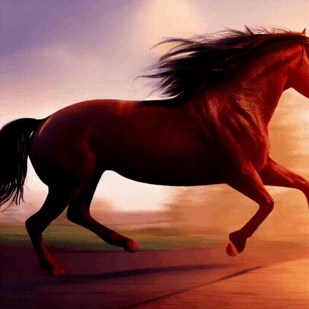
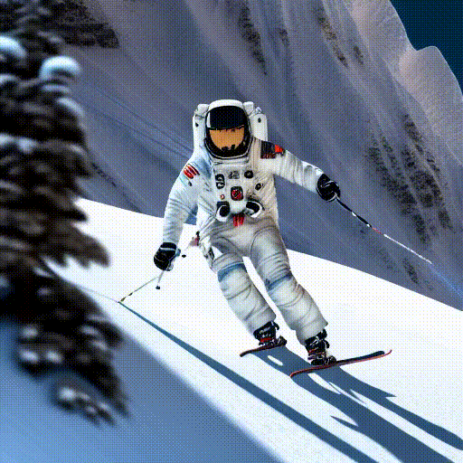
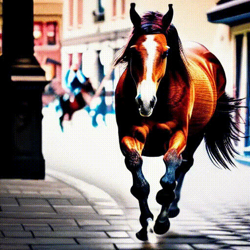

# Zero-Shot Video Sampling from Image

## Comparison with baseline

| Method   |                 A cat is running on the grass.                 |             An astronaut is skiing down the hill.              |                 A horse galloping on a street.                 |
| :------- | :------------------------------------------------------------: | :------------------------------------------------------------: | :------------------------------------------------------------: |
| T2V-Zero |   |  |  |
| Ours     |  |  |  |